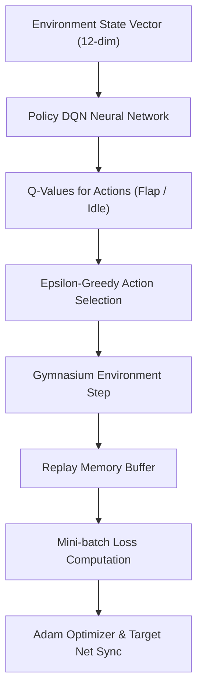

# Flappy Bird Reinforcement Learning (DQN)

A Deep Q-Network (DQN) reinforcement learning agent trained to play **Flappy Bird** using **PyTorch**, **Gymnasium**, and **flappy-bird-gymnasium**.


---

## 📐 Architecture Overview



---

## 🚀 Features

- **Deep Q-Learning (DQN)**: Neural network policy mapping state vectors to flap / no-flap actions.
- **Experience Replay Memory**: Replay buffer with FIFO queue for stable training over sampled mini-batches.
- **Target Network Synchronization**: Periodic target network weight updates to stabilize Q-value estimation.
- **Configurable Hyperparameters**: Easily tweak learning rates, gamma, epsilon decay, and batch sizes via `parameters.yaml` & `config.py`.
- **Cross-Platform Compatibility**: Automatically maps device checkpoints across CUDA, MPS (Apple Silicon), and CPU.

---

## 🛠️ Installation

1. Clone the repository:
   ```bash
   git clone https://github.com/Ishwarkafle/Flappy-Bird-Reinforcement-Learning-Better.git
   cd Flappy-Bird-Reinforcement-Learning-Better
   ```

2. Install the required dependencies:
   ```bash
   pip install -r requirements.txt
   ```

---

## 🎮 Usage

### 1. Evaluate Pre-trained Agent (Demo)
Run the agent in evaluation mode with rendering enabled:
```bash
python agent.py flappybirdv0
```

Evaluate over 10 episodes with statistical summary:
```bash
python evaluate.py --episodes 10
```

### 2. Train a New Model
Train the DQN agent for a specified number of episodes with optional random seed:
```bash
python agent.py flappybirdv0 --train --episodes 10000 --seed 42
```

### 3. Play Manually
Test your human skills against the game using the Spacebar:
```bash
python play_human.py
```

### 4. Plot Training Progress
Visualize best rewards logged during training:
```bash
python plot_rewards.py
```

---

## ⚙️ Hyperparameters (`parameters.yaml`)

```yaml
flappybirdv0:
  env_id: FlappyBird-v0
  epsilon_init: 1.0
  epsilon_min: 0.05
  epsilon_decay: 0.9995
  replay_memory_size: 100000
  mini_batch_size: 32
  network_sync_rate: 10
  alpha: 0.001
  gamma: 0.99
  reward_threshold: 1000
```

---

## 📁 Repository Structure

```
├── agent.py               # Main DQN agent training and evaluation script
├── config.py              # Hyperparameter dataclass and validation schema
├── dqn.py                 # PyTorch Neural Network architecture
├── evaluate.py            # Model evaluation & metrics benchmark utility
├── experience_replay.py   # Replay Buffer implementation
├── game_flappy_bird.py    # Legacy game script
├── play_human.py          # Interactive PyGame keyboard controller
├── parameters.yaml        # Training hyperparameters configuration
├── plot_rewards.py        # Reward logging and visualization tool
├── requirements.txt       # Dependencies manifest
└── runs/                  # Saved checkpoints (.pt) and logs (.log)
```

---

## 📄 License

This project is licensed under the MIT License.
